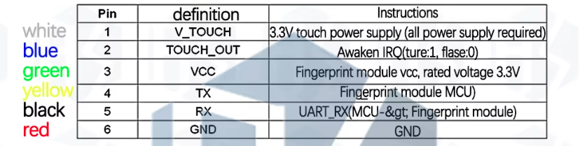

# Fingerprint lock with admin system

- ## How does it work
  - If there are no fingerprints registered, it'll enroll one.
  - The first fingerprint (uid 1) will be the admin fingerprint
  - To add a user hold the admin finger for 10 seconds and remove the finger after it starts to blink green. Enroll fingerprint after the fingerprint sensor led ring turns yellow. Use serial monitor for guided enrollment.
  - The user can delete him/her self by holding the finger for more than 10 seconds.
  - The admin can delete all fingerprints by holding the finger for more than 15 seconds.
  - Change `lockPin` to a desired GPIO pin (default 21).

- ## How to upload
  - Use PlatformIO vscode extension or cli.
  - If using vscode click on the uplod button. If using platfomIO cli run `pio run --target upload`
 
- ## Troubleshooting
  - ### If the sensor if having trouble enrolling fingerprints connect the `SFM_VCC` pin of the fingerprint sensor directly to the 3.3v pin on the esp32 and the `V_TOUCH` pin of the sensor to the defined `SFM_VCC` pin on the sensor.

### Note: Since the esp32 GPIO voltage is 3.3v using a mosfet is the better option eg: IRFZ44N.

#### fingerprint sensor pinout

